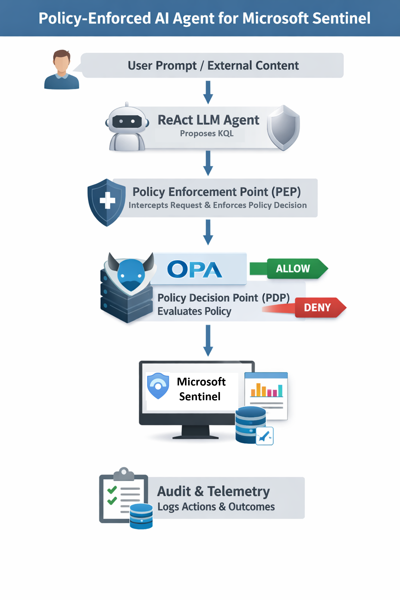

# Policy-Enforced AI Agent for Microsoft Sentinel

**ReAct + Open Policy Agent (OPA) + code-based PEP + audit telemetry**

This repository demonstrates a policy-enforced AI security pattern for Microsoft Sentinel / Log Analytics.

The core idea is simple:

> LLM-generated KQL is untrusted and must be externally evaluated before execution.

Instead of allowing an AI agent to directly query security data, this prototype places a code-based **Policy Enforcement Point (PEP)** between the agent and the execution layer. The PEP sends execution context to an external **Policy Decision Point (PDP)** implemented with **Open Policy Agent (OPA)**. Only approved KQL requests are allowed to proceed.

This is a reference architecture and prototype for governed AI-assisted security operations. It is not a production security product.

---

## What this demonstrates

This project shows how to enforce controls around AI-generated security actions:

- Treat model-generated KQL as untrusted output
- Intercept tool execution before Sentinel / Log Analytics access
- Evaluate policy outside the model using OPA
- Require time-bounded and result-bounded queries
- Deny unsafe requests by default
- Write audit events for policy decisions and tool outcomes

The model can propose. The system decides.

---

## Architecture

```text
User request
    ↓
ReAct-style AI agent
    ↓
Generated KQL tool request
    ↓
Code-based PEP
    ↓
OPA policy decision point
    ↓
ALLOW → Microsoft Sentinel / Log Analytics
DENY  → block and audit
    ↓
Audit / telemetry record
```

A fuller architecture explanation is available in [`docs/architecture.md`](docs/architecture.md).



---

## Repository structure

```text
.
├── app/
│   ├── agents/
│   │   ├── react/react_agent.py
│   │   └── soc/react_soc_agent.py
│   ├── llm/azure_openai_client.py
│   ├── mcp/
│   │   ├── executor.py
│   │   └── tools.py
│   ├── orchestrator/orchestrator.py
│   ├── pdp/pdp.py
│   └── telemetry/
│       ├── audit.py
│       └── logger.py
├── contracts/tools_contract.json
├── demos/safe_opa_demo.py
├── docs/
│   ├── architecture.md
│   ├── control-mapping.md
│   └── threat-model.md
├── images/policy-enforced-ai-agent-architecture.png
├── samples/
│   ├── input-allowed.json
│   ├── input-denied.json
│   ├── output-allowed.json
│   ├── output-denied.json
│   └── audit-log.jsonl
├── policy.rego
├── requirements.txt
├── .env.example
├── main.py
└── README.md
```

---

## Quickstart: safe demo without live Sentinel

Use this path first. It does **not** require Microsoft Sentinel, Azure OpenAI, or live workspace credentials.

It only requires Python and OPA running locally.

### 1. Install Python dependencies

```bash
python -m venv .venv
.venv\Scripts\activate
pip install -r requirements.txt
```

For macOS/Linux:

```bash
python3 -m venv .venv
source .venv/bin/activate
pip install -r requirements.txt
```

### 2. Start OPA

From the repo root:

```bash
opa run --server policy.rego
```

OPA should listen on:

```text
http://localhost:8181
```

### 3. Run the safe policy demo

In a second terminal:

```bash
python demos/safe_opa_demo.py
```

Expected behavior:

- the bounded query is allowed
- the unbounded query is denied
- sample policy decisions are printed
- no live Sentinel query is executed

---

## Sample OPA inputs

Allowed request:

```json
{
  "input": {
    "action": "kql.read.SigninLogs",
    "table": "SigninLogs",
    "query": "SigninLogs | where TimeGenerated > ago(7d) | take 100",
    "limit": 100,
    "has_time_filter": true
  }
}
```

Denied request:

```json
{
  "input": {
    "action": "kql.read.SigninLogs",
    "table": "SigninLogs",
    "query": "SigninLogs | summarize count()",
    "limit": 1000,
    "has_time_filter": false
  }
}
```

The same examples are stored under [`samples/`](samples/).

---

## Optional live Sentinel path

The live path uses the ReAct agent, Azure OpenAI, the PEP, OPA, and Microsoft Sentinel / Log Analytics.

Set environment variables first. A template is provided in [`.env.example`](.env.example).

```bash
AZURE_OPENAI_ENDPOINT=<your-endpoint>
AZURE_OPENAI_API_KEY=<your-api-key>
AZURE_OPENAI_API_VERSION=2024-05-01-preview
AZURE_OPENAI_DEPLOYMENT=<deployment-name>
LOGS_WORKSPACE_ID=<workspace-id>
OPA_URL=http://localhost:8181/v1/data/sentinel/allow
```

Start OPA:

```bash
opa run --server policy.rego
```

Run the agent:

```bash
python main.py
```

The live path requires valid Azure identity permissions for the target Log Analytics workspace.

---

## Key files

### `app/mcp/executor.py`
Acts as the effective Policy Enforcement Point. It intercepts tool requests, derives query context, applies result limits, calls the PDP, and executes only approved KQL.

### `app/pdp/pdp.py`
Calls OPA for policy evaluation. If OPA is unreachable or fails, the decision defaults to DENY.

### `policy.rego`
Defines the OPA policy used by the demo. The policy allows only approved Sentinel tables, requires a time filter, requires a bounded result limit, and blocks dangerous query patterns.

### `demos/safe_opa_demo.py`
Runs allow/deny examples against OPA without connecting to Sentinel.

### `samples/`
Contains example inputs, outputs, and audit events for documentation and review.

---

## Security design intent

This project is intentionally focused on enforcement, not prompt-only safety.

The pattern is:

1. Let the AI system propose a candidate action
2. Treat the proposed action as untrusted
3. Intercept execution with a PEP
4. Evaluate policy with an external PDP
5. Allow only constrained and auditable actions
6. Fail closed when policy evaluation is unavailable

This aligns to the F7-LAS control model:

- **Layer 4: Tool mediation**
- **Layer 5: External policy enforcement**
- **Layer 7: Monitoring, telemetry, and audit**

---

## Threat model

The threat model is documented in [`docs/threat-model.md`](docs/threat-model.md).

Primary risks include:

- Prompt injection causing unsafe query generation
- Overbroad security data access
- Missing time filters
- Excessive result limits
- Sensitive data exposure
- Unauthorized tool use
- Policy bypass attempts
- Weak auditability

---

## Control mapping

A simple control mapping is provided in [`docs/control-mapping.md`](docs/control-mapping.md).

It maps the prototype to:

- OWASP Top 10 for LLM Applications
- MITRE ATLAS concepts
- NIST AI RMF-style governance functions
- F7-LAS layered controls

---

## Current state

This is a working prototype / reference pattern. It is suitable for demonstrating:

- governed AI-assisted security investigation
- externalized policy decisions
- policy-mediated KQL execution
- auditable AI tool use

It is not production-ready. Production use would require stronger identity controls, deployment hardening, policy lifecycle management, secure secret handling, monitoring, testing, and review by responsible engineering and security teams.

---

## Disclaimer

This repository is an independent prototype and reference architecture. It is not Microsoft product guidance, customer implementation guidance, or a production security product.

